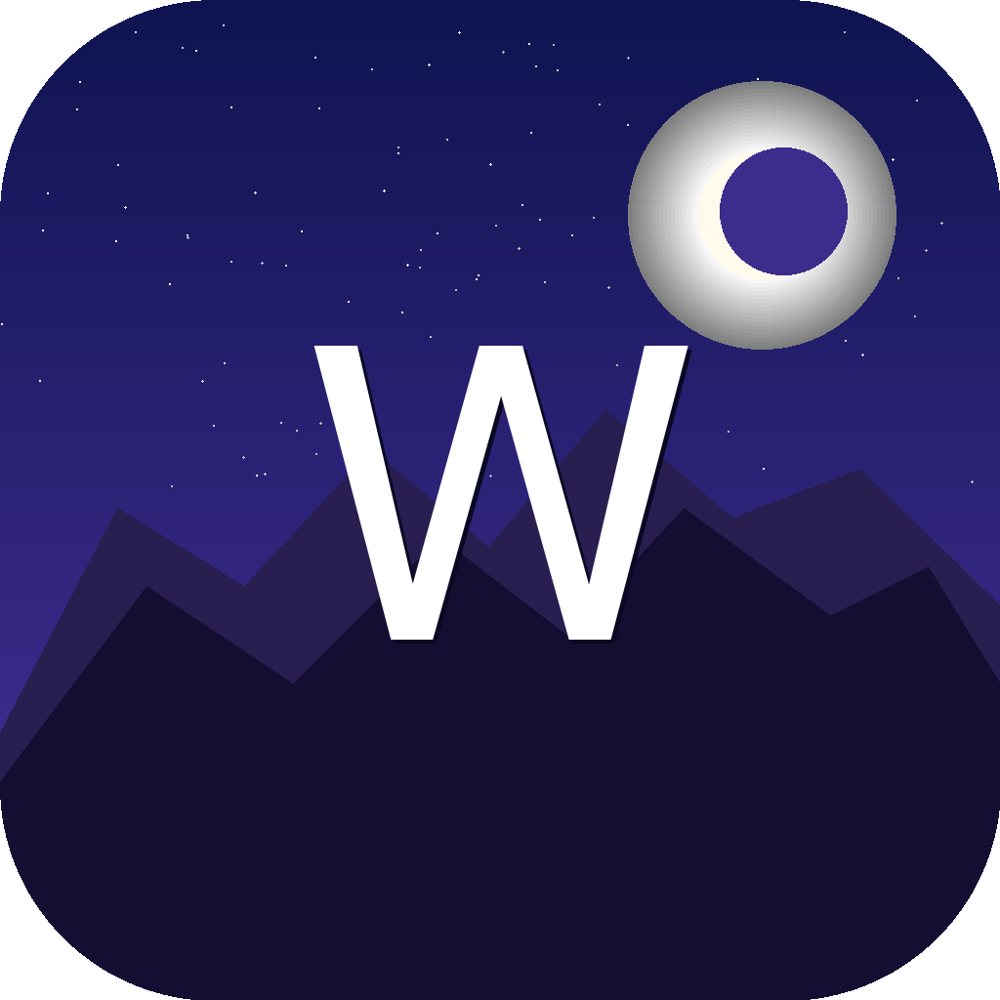
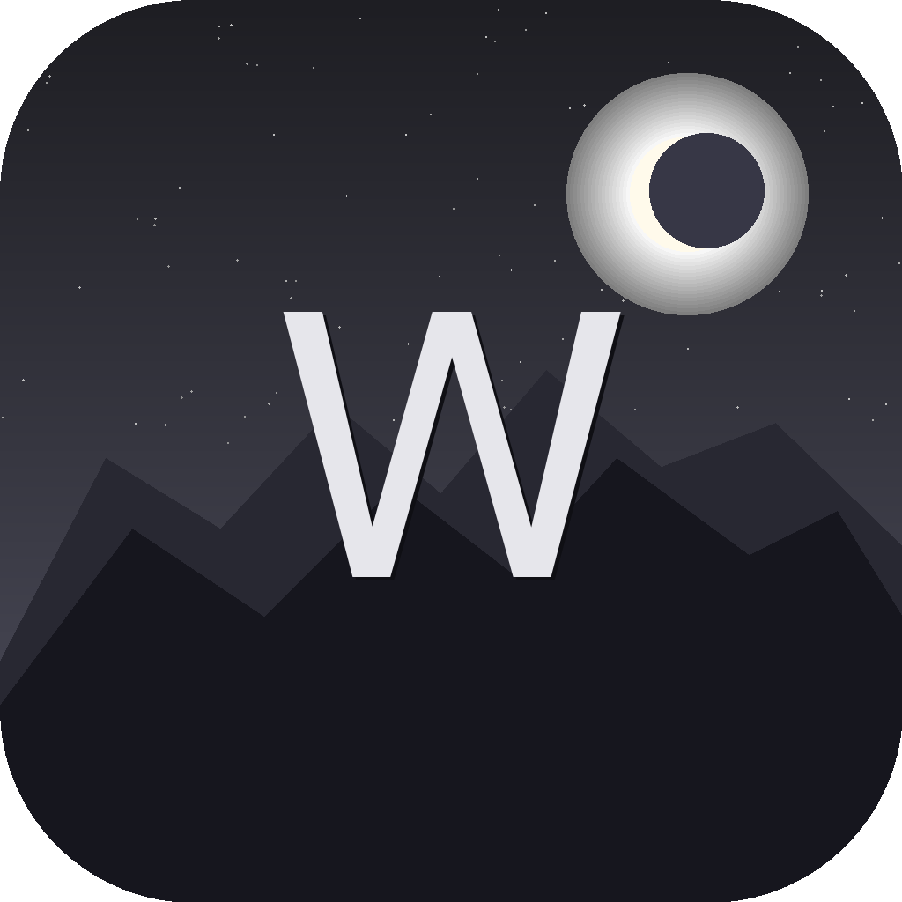

[**English**](README.md) | [**中文**](README.zh.md)

# Wallhaven

基于 [Wallhaven API](https://wallhaven.cc/help/api) 的原生 iOS 壁纸浏览器。

<table align="center">
  <tr>
    <td align="center"></td>
    <td align="center"></td>
    <td align="center"></td>
  </tr>
</table>

## 功能特性

- **首页** — 最新壁纸，双列瀑布流布局，无限滚动
- **搜索** — 关键词 + 筛选器（类别、分级、排序、分辨率、比例、颜色）
- **详情** — 全分辨率查看，左右滑动切换，下滑返回，相关缩略图，信息面板，分享，保存到相册
- **收藏** — 收藏壁纸（爱心按钮），上下文菜单删除
- **收藏集** — 本地文件夹管理壁纸（星标按钮），重命名和删除，自动创建"Default"收藏集
- **设置** — API 密钥，外观（浅色/深色/跟随系统），图片缓存管理，同步用户偏好

## 系统要求

- iOS 26.4+
- Xcode 26.5+

## 安装

无第三方依赖。

### 从 Xcode 运行（模拟器 — 无需账号）

1. 克隆仓库
2. 在 Xcode 中打开 `Wallhaven.xcodeproj`
3. 选择 iOS 模拟器并运行（⌘R）

### 从 Xcode 运行（真机 — 需要 Apple Developer 账号）

1. 克隆仓库
2. 在 Xcode 中打开 `Wallhaven.xcodeproj`
3. 在 **Signing & Capabilities** 中修改 **Bundle Identifier** 为唯一值，选择您的 **Team**
4. 连接设备并运行（⌘R）

### 命令行

#### 模拟器构建

```bash
xcodebuild -scheme Wallhaven -sdk iphonesimulator \
  -destination 'platform=iOS Simulator,name=iPhone 17 Pro,OS=26.5' build
```

无需签名或开发者账号。

#### 未签名 IPA（侧载）

```bash
./build.sh
```

在仓库根目录生成 `Wallhaven.ipa`。适用于 AltStore、SideStore 等侧载工具。

步骤：
1. 清理之前的构建产物
2. 使用 `generic/platform=iOS` Release 配置构建，`CODE_SIGN_IDENTITY="" CODE_SIGNING_ALLOWED=NO`
3. 将 `.app` 打包到 `Payload/` 目录并压缩为 `Wallhaven.ipa`

#### 签名 IPA + 安装到设备

```bash
./install.sh

# 覆盖开发团队：
DEVELOPMENT_TEAM=XXXXXXXXXX ./install.sh
```

需要 Apple Developer 账号和已连接配对的 iPhone。生成 `Wallhaven.ipa` 并通过 `devicectl` 安装。

步骤：
1. 从 `Wallhaven.xcodeproj/project.pbxproj` 读取 `DEVELOPMENT_TEAM`
2. 回退到 `security find-identity` 自动检测
3. 使用解析到的 Team 构建，添加 `-allowProvisioningUpdates`
4. 将 `.app` 打包为 `Wallhaven.ipa`
5. 通过 `xcrun devicectl list devices` 查找已连接的第一台 iPhone
6. 使用 `xcrun devicectl device install app` 安装应用

## 配置

无需 API 密钥即可浏览 SFW 内容。要启用 NSFW 和个人偏好：

1. 进入 **设置** → **设置 API 密钥**
2. 从 [wallhaven.cc/account](https://wallhaven.cc/account) 粘贴您的密钥

API 基础 URL 默认为 `https://wallhaven.cc/api/v1`，可在设置中修改。

## 架构

- **MVVM** 使用 `@Observable`（非 ObservableObject）。ViewModel 标记为 `@MainActor`。
- **网络** — `WallhavenFetch` actor，使用 `URLSession` async/await
- **缓存** — 基于 `NSCache` 的 `CacheImage`（150 MB 限制），所有图片加载使用 `CacheAsyncImage`
- **持久化** — SwiftData（`FavoriteWallpaper`、`CollectionFolder`、`CollectionItem`）
- **收藏集** — 纯本地：`CollectionFolder` 通过 `CollectionItem` 成员关系分组壁纸；不调用 API
- **导航** — `NavigationState`（`@Observable`、`@Environment`）实现跨标签页搜索标签流转
- **本地化** — 英文、简体中文
- **布局** — 自定义 `FlowLayout`（遵循 `Layout` 协议）用于瀑布流网格

## 项目结构

```
Wallhaven/
  App/                  根 ContentView 和 TabView
  Models/
    Search/             API 响应类型和搜索筛选器
    Favorite/           SwiftData 模型（Favorite、Collection）
  Services/             WallhavenFetch actor、图片缓存、UserSettingsStore
  Utilities/            FlowLayout、LoadState、ShareSheet
  ViewModels/           每个页面一个 @Observable VM
  Views/
    Components/         可复用 UI（CellView、GridView、ErrorView 等）
    Home/               首页标签页（瀑布流、无限滚动）
    Search/             搜索标签页（筛选面板、搜索结果）
    Detail/             壁纸详情（查看器、工具栏、信息面板）
    Favorites/          收藏标签页（分段选择器、收藏集、重命名/删除）
    Settings/           设置标签页（通用、API、缓存、关于）
  Docs/                 Wallhaven API v1 参考
```

## 许可

[Apache License 2.0](LICENSE)
